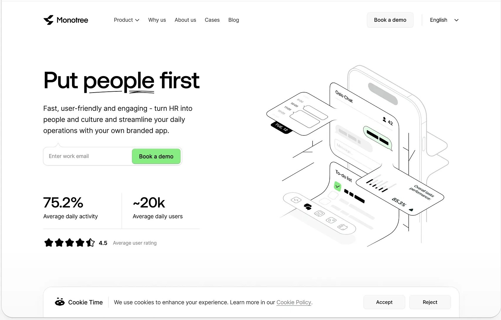
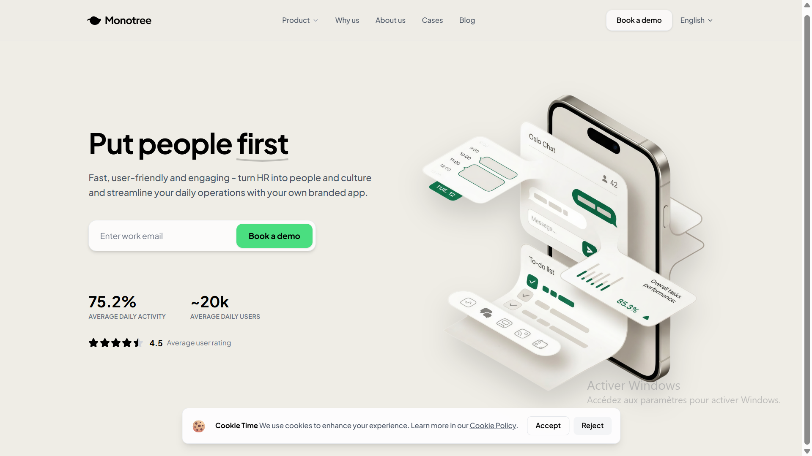

# 🎨 Monotree UI Clone

A pixel-perfect clone of the Monotree landing page, built with modern web technologies and a custom warm beige design theme.


*Original Monotree Design (Reference)*


*Cloned Version with Custom #EFEDE6 Theme*

## ✨ Features

- 🎯 **100% Visual Fidelity** - Pixel-perfect recreation of the Monotree UI
- 🎨 **Custom Theme** - Warm beige background (`#EFEDE6`) instead of white
- ⚡ **Modern Stack** - Built with Vite, React, TypeScript, and Tailwind CSS v4
- 📱 **Responsive Design** - Mobile-first approach with seamless desktop scaling
- 🌊 **Glassmorphism Effects** - Modern UI with backdrop blur and transparency
- ✅ **Clean Code** - TypeScript strict mode, no unused imports

## 🛠️ Tech Stack

- **Framework**: [React 19](https://react.dev/) with TypeScript
- **Build Tool**: [Vite 7](https://vitejs.dev/)
- **Styling**: [Tailwind CSS v4](https://tailwindcss.com/)
- **Icons**: [Lucide React](https://lucide.dev/)
- **Fonts**: [Plus Jakarta Sans](https://fonts.google.com/specimen/Plus+Jakarta+Sans) (Google Fonts)

## 🎨 Design Highlights

### Color Palette
- **Background**: `#EFEDE6` - Warm beige/cream
- **Primary Text**: `#000000` - Pure black
- **Accent**: `#4ade80` - Vibrant green
- **Interactive Elements**: White with 70-90% opacity + backdrop blur

### Key Components
1. **Navbar** - Sticky header with glassmorphism effect
2. **Hero Section** - Two-column layout with headline, CTA form, and stats
3. **Illustrations** - Custom isometric 3D app mockup
4. **Cookie Banner** - Floating bottom banner with smooth transitions

## 🚀 Getting Started

### Prerequisites
- Node.js 18+ 
- npm or yarn

### Installation

```bash
# Clone the repository
git clone https://github.com/SamalehZen/Dribbble-Clone.git

# Navigate to project directory
cd Dribbble-Clone

# Install dependencies
npm install

# Start development server
npm run dev
```

### Build for Production

```bash
# Create optimized build
npm run build

# Preview production build
npm run preview
```

## 📂 Project Structure

```
DD/
├── public/
│   ├── 1.jpg                    # Original design reference
│   ├── 2.png                    # Final result screenshot
│   └── hero-illustration.png    # Hero section image
├── src/
│   ├── components/
│   │   ├── Navbar.tsx          # Header navigation
│   │   └── Hero.tsx            # Main hero section
│   ├── App.tsx                 # Main application
│   ├── index.css               # Tailwind + custom theme
│   └── main.tsx                # Entry point
├── tailwind.config.js
├── vite.config.ts
└── package.json
```

## 🎯 Design Decisions

### Why Beige Theme?
The custom `#EFEDE6` background provides:
- ✅ Reduced eye strain compared to pure white
- ✅ Warm, premium aesthetic
- ✅ Better contrast for glassmorphism effects
- ✅ Modern, sophisticated look

### Typography
**Plus Jakarta Sans** was chosen for:
- Clean, geometric letterforms
- Excellent readability at all sizes
- Professional yet friendly appearance
- Variable font weights (400-800)

## 📸 Screenshots Comparison

### Before (Original)


### After (Cloned with Custom Theme)


## 🤝 Contributing

Contributions are welcome! Feel free to:
1. Fork the project
2. Create a feature branch (`git checkout -b feature/amazing-feature`)
3. Commit your changes (`git commit -m 'Add amazing feature'`)
4. Push to the branch (`git push origin feature/amazing-feature`)
5. Open a Pull Request

## 📝 License

This is a learning/portfolio project. The original Monotree design belongs to their respective owners.

## 👤 Author

**SamalehZen**
- GitHub: [@SamalehZen](https://github.com/SamalehZen)

---

⭐ **Star this repo** if you found it helpful!

Built with ❤️ using React + Tailwind CSS
